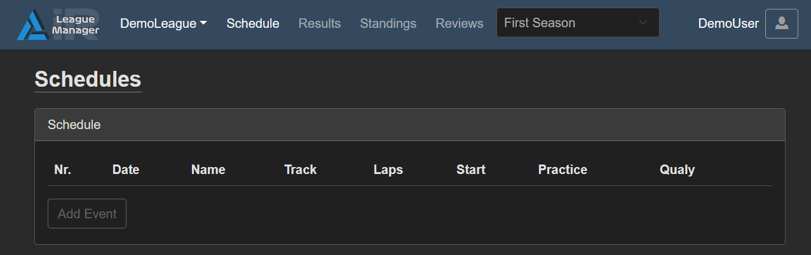
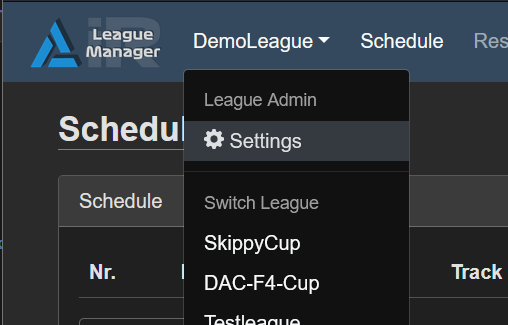
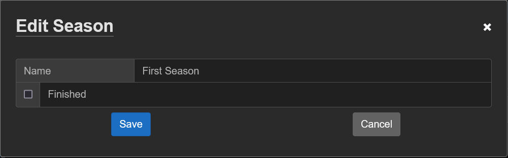

# Create League

## Create your own league

!!! warning
    Creating your league is not possible through the UI yet.
    If you want to have a league created please write a request to [simon@irleaguemanager.net](mailto:simon@irleaguemanager.net)

## First season and schedule

By default a new league already has a default season and schedule configured:
> 

If you want to change the name of the season you can do so by navigating to the settings page
Menu -> *LeagueName* -> Settings
> {width="300"}

On the settings page, click on the Season shown in the list and it will open a new Modal where you can change the name.
> 

Type in the name you want and click "Save" to apply the changes.

