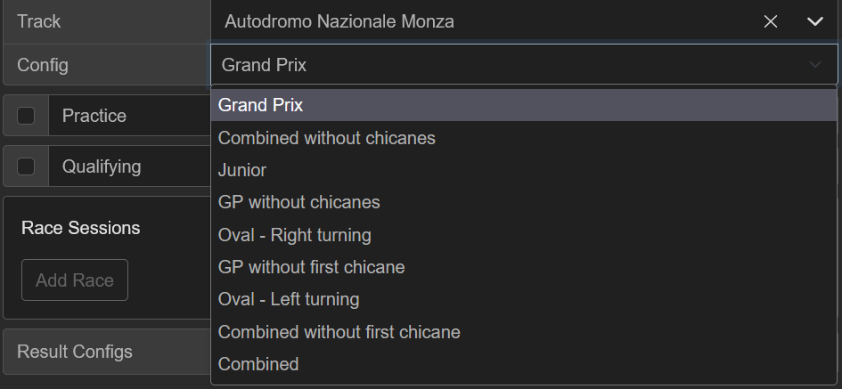
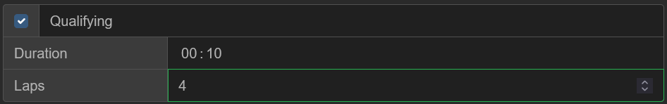
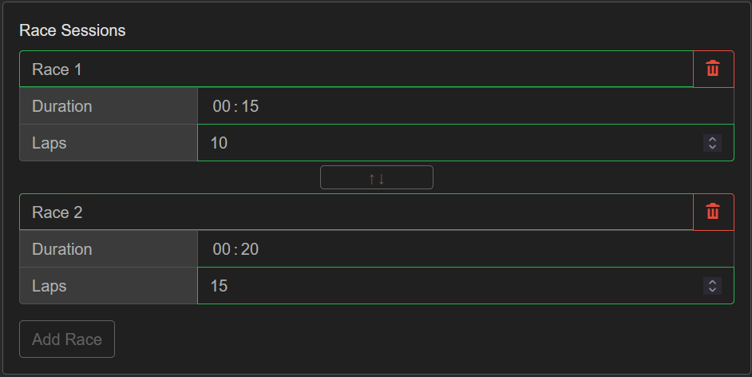
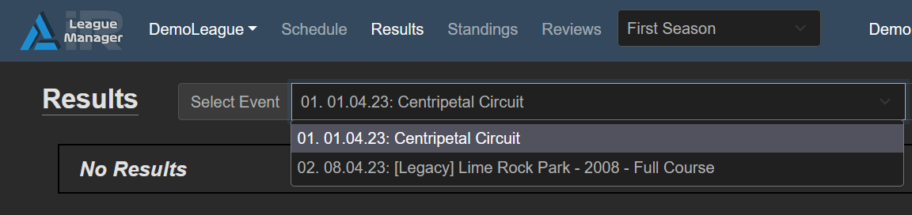
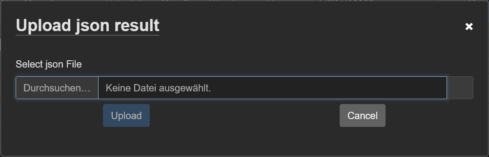
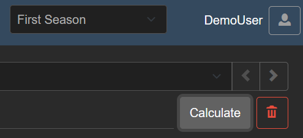

# Events and Results

### Create Events

Events are Created on the **Schedule** section.

To add an event to the Schedule click the **"Add Event"** Button 
below and a modal window will open to configure the event settings.

#### Name, Date & Time

At first you need to fill in the basic event information like date and time of event.
Optionally you may also specify an Event name for easier identifiaction.

The date and time will be set in your local time zone so you should not have to worry about conversions.
The start time should ideally coincide with the start of the session in iRacing.

#### Track & Config

Next step is to select the track and config. You can search for tracks by name and/or select them from the dropdown.
For each track the available configurations will be shown and can be selected after the track selection.
> {width="500"}

#### Sessions

And event is divided into multiple sessions that run in succession.

    Practice -> Qualifying -> Race (-> Race#2)

Each session can be individually configured by duration and maximum number of laps.

##### Practice and Qualifying

You can optionally define attached practice and qualifying sessions for your event.
Just check the box for either practice/qualy and then enter the desired duration time or the number of laps (or both)
> {width="500"}

!!! note
    While there is no problem with uploading results from iRacing sessions that have a different 
    configuration for either practice or qualifiying it is still recommended to use the same
    configuration as in iRacing so the start and duration times match.

##### Race Session(s)

Finally configure the race mode of your event. Typically there is two main constellations that you want to run your race in:

> 1. **Single Race**
> 2. **Multi Race (Heats)**

Both can be configured the same in iRLeagueManager by simply adding the desired number of race sessions for the event.
> {width="500"}

#### Event Result Configurations

In order to produce the correct results for your event you need to select the according result configurations.
Read more about managing result configurations visit  
-> [Result Configurations](settings/championships#result-configurations)

#### Creating multiple Events
!!! note
    If you are creating multiple events in succession the settings from the previous event will be copied to the new event automatically.
    That way you will not have to type everything again and can reuse the settings.

### Upload Results

!!! note
	This section shows how to the result files from iracing and upload them into iRLeagueManager.
	A direct import using the iracing data API is currently in the works and will be available in the future.

#### Export Results from iRacing

iRLeagueManager uses the `json` export feature from **iRacing** to import the results into the tool.
To get the results you need to open the **iRacing UI** and go to the result you want to export and click *Export Results*
> 

Save the json file some where you can find it.

#### Upload to iRLeagueManager

1.  Go to the **Results** section of your league
	{width="500"}

2.  Select the Event you want to upload the result for
	{width="540"}

3.  Click on *Upload Result* and select the json file that you saved earlier
	{width="450"}

4.  You may need to refresh the page before the event results should show up

#### Re-Calculate Results

Sometime the recalculation of a result is needed, for example after you made some changes to the championship or to apply penalties from reviews.
You can simply do this by clicking on the *Calculate* button displayed above the result
> {width="300"}

!!! warning
	Calculation of the results cannot be reverted and will be active immediately. Please make sure you do not accidentally lose any data before calculating.