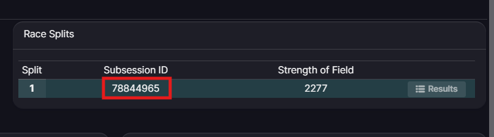
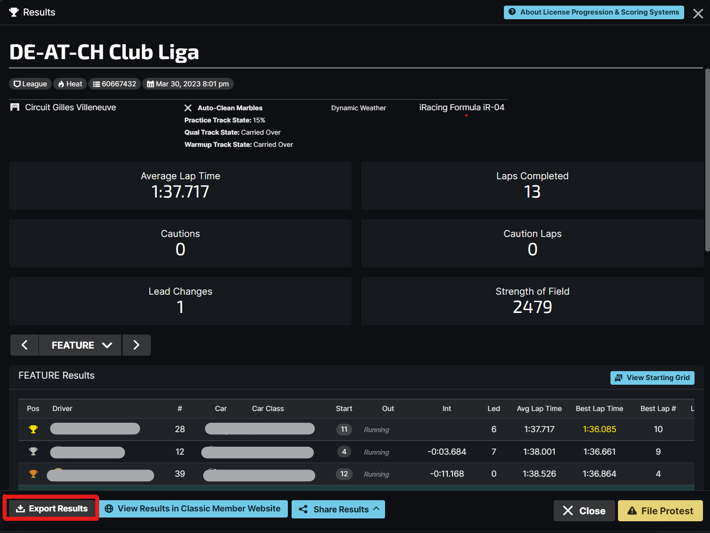

# Upload Results

There are currently two ways to upload results into iRLeagueManager:

-  **[Import from SubsessionId](#import-from-subsessionid)**: Use the iRacing data API to import results directly into iRLeagueManager.
-  **[Upload JSON File](#upload-json-file)**: Upload the results from iRacing manually using the `json` export feature.

## Import from SubsessionId

Importing the relts from iRacing is the quickest and preferred method to upload results into iRLeagueManager. 
For this method to work you only need to get the **SubsessionId** of the session you want to import.
You can find the SubsessionId by opening the result in the iRacing UI and looking at the **Race splits** section.

{width="450"}

Then continue with the following steps:

1.  Go to the **Results** section of your league
	
2.  Make sure the correct event to upload the results to is selected in the session dropdown.  
	
	{width="500"}
	{width="500"} 

3. Click on **Fetch from SubsessionId** and enter the **SubsessionId** you copied earlier.  
	
	{width="400"}
	{width="400"}]

!!! Note "Results Processing"
    
	Results will be uploaded and processed directly after the upload. The page should refresh once the process is complete.
	If you do not see the results after the upload please try refreshing the page manually after a few seconds.

	If the results are still not visible after that please contact support via [Discord](https://discord.gg/XUG2kad)

## Upload JSON File

#### 1. Export Results from iRacing

iRLeagueManager uses the `json` export feature from **iRacing** to import the results into the tool.
To get the results you need to open the **iRacing UI** and go to the result you want to export and click *Export Results*

{width="600"}

Save the json file some where you can find it, for example your Documents folder.

#### 2. Upload to iRLeagueManager

1.  Go to the **Results** section of your league

2.  Make sure the correct event to upload the results to is selected in the session dropdown.
	
	{width="500"}
	{width="500"}

3.  Click on **Upload Result** and then **Select File**. In the opened File dialog, select the json file that you saved earlier  
	
	{width="450"}
	{width="450"}

!!! Note "Results Processing"
    
	Results will be uploaded and processed directly after the upload. The page should refresh once the process is complete.
	If you do not see the results after the upload please try refreshing the page manually after a few seconds.

	If the results are still not visible after that please contact support via [Discord](https://discord.gg/XUG2kad)

## Recalculate Results

Sometimes the recalculation of a result is needed, for example after you made some changes to the championship or to apply penalties from reviews.
You can simply do this by selecting the **Calculate** option in the results dropdown menu, located at the top right of the results page.

{width="300"}
{width="300"}

!!! warning "Recalcualtion is Permanent"
	
	Please be aware that the calculation of the results is a permanent action and cannot be reverted.
	Make sure you have the correct settings and configurations in place before recalculating the results.