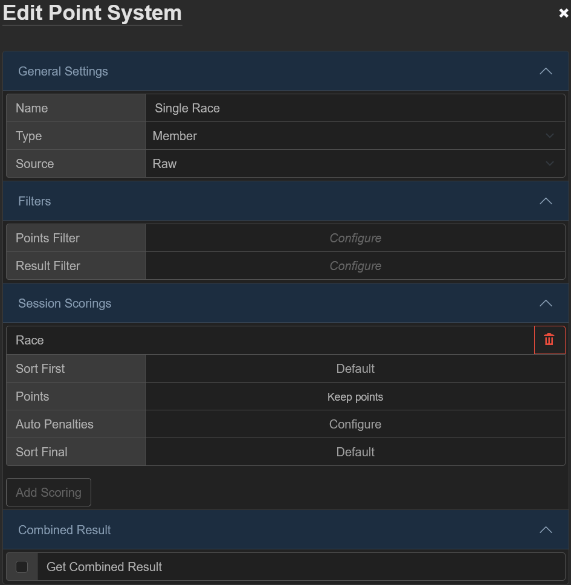
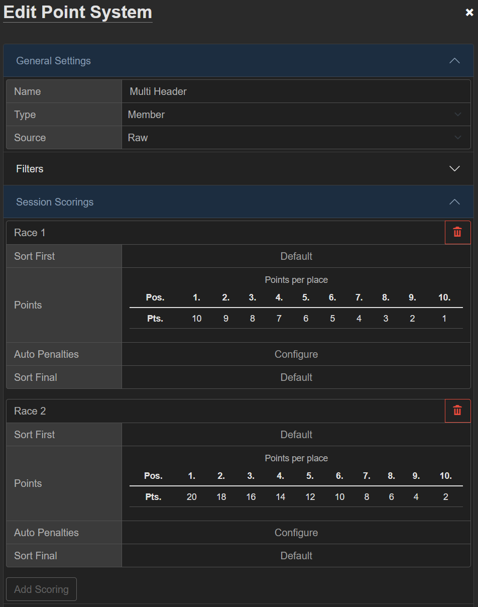
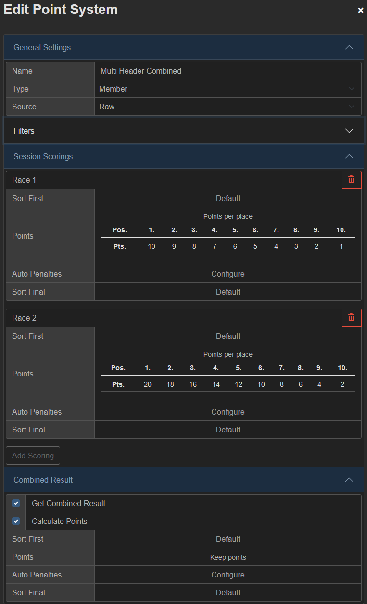
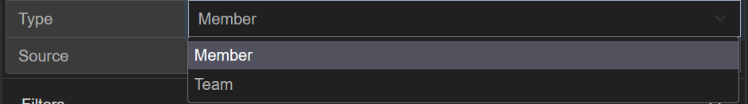
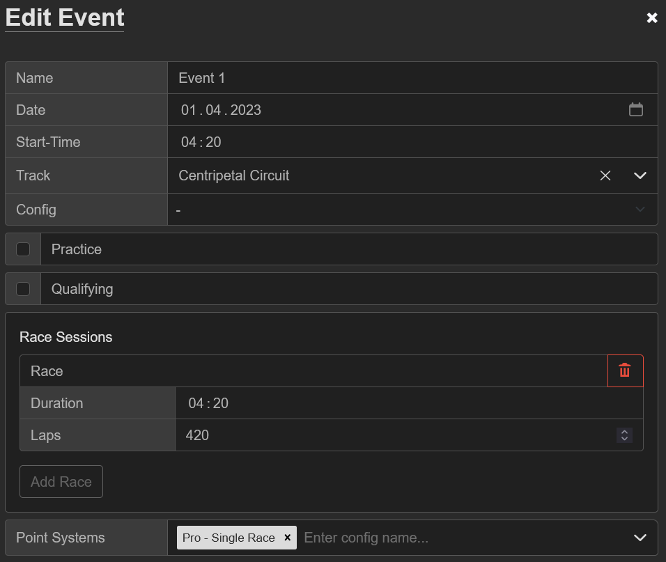

# Championships

## IRLM Results Explained

IRLeagueManager uses a top-down approach for configuring your leagues result and standings tables.
The idea is to give you as the league admin maximum flexibility without constraining you to certain scoring or session types.

The system can be divided into the following categories:

| Category                                   | Description                                        |
| ------------------------------------------ | -------------------------------------------------- |
| [Championship](#championships-seasons)     | Top category for points and standings for a season |
| [Point Systems](#point-systems)            | How points are scored for a single event           |
| [Scorings](#scorings)                      | How points are scored for a single session         |

The championship at the top holds the configuration for the whole season and can be made up out of one or more point systems.
Each point system requires at leas one scoring (or more in case of heat races) to calculate the points out of the events subsessions.

## Championships & Seasons

Each championship will have its own section of results and standings tables. You can choose to run multiple championships in parallel during the season (e.g: Drivers & Teams or Pro & Am)

Championships support the following configurations

- **Name**  
  Name to identify the championship (only seen by admins)
- **Display Name**  
  Name to show on top of the results and standings tables
- **Point Systems**  
  List of point systems that can be used for individual events
- **Standings**  
  Options how to calculate final standings

Each season you create can enable one or more championship and settings can be changed individually for each season without affecting other seasons.

## Point Systems

The point system is at the core of defining your championships behaviour. A point system can be viewed as a rule how to create a scored from a single event.
Each point system allows you to specify filters to exclude entries from either gaining points or the result table completely and you can select to create a combined result when having multiple scorings.

??? example "Here are some quick examples how to use Point System and Scorings"

    === "Single Race Event"
        ``` mermaid
        graph LR
            subgraph Event
                direction TB
                ses1[Qualy]
                ses2[Practice]
                ses3[Race]
            end
            subgraph Point[Point System]
                ses3 --> scor1[Scoring]
            end
            subgraph Result[Results]
                ses1 --> res2[Qualy Result]
                ses2 --> res3[Practice Result]
                scor1 --> res1[Race Result]
            end
        ```
        {style="width: 100%; max-width: 550px;"}

    === "Multi Header Event"
        ``` mermaid
        graph LR
            subgraph Event
                direction TB
                ses1[Qualy]
                ses2[Practice]
                ses3[Session1]
                ses4[Session2]
            end
            subgraph Point[Point System]
                ses3 --> scor1[Scoring1]
                ses4 --> scor2[Scoring2]
            end
            subgraph Result[Results]
                ses1 --> res3[Qualy Result]
                ses2 --> res4[Practice Result]
                scor1 --> res1[Race1 Result]
                scor2 --> res2[Race2 Result]
            end
        ```
        {style="width: 100%; max-width: 550px;"}

    === "Multi Header with Combined Result"
        ``` mermaid
        graph LR
            subgraph Event
                ses1[Qualy]
                ses2[Practice]
                ses3[Session1]
                ses4[Session2]
            end
            subgraph Point[Point System]
                ses3 --> scor1[Scoring1]
                ses4 --> scor2[Scoring2]
                comb[Combined Scoring]
            end
            subgraph Result[Results]
                ses1 --> res4[Qualy Result]
                ses2 --> res5[Practice Result]
                scor1 --> res2[Race1 Result]
                scor2 --> res3[Race2 Result]
                res2 --> res1[Combined Result]
                res3 --> res1[Combined Result]
                comb --> res1[Combined Result]
            end
        ```
        {style="width: 100%; max-width: 550px;"}

### General

The general settings define the name of the Point System, the type and optional another point system as source for the result calculation.

#### Point System Type



Chose between **Member** and **Team**:
- Member: Score each driver individually
- Team:   Add points of drivers in the same team together

If you select **Team** you will also be allowed to specify the maximum number of drivers scored for each race.

#### Source


The **Source** option lets you optionally specify another Point System as the base for the current one. In this case the results, and all calculated points and penalties, will not be taken from the **Raw** uploaded result but instead the calculated one from the **Source**
This setting is most commonly used with Driver & Team championships where on the **Driver** championship you would calculate the points from the raw result and in the **Team** championship you will specify **Driver** as the source and reuse the already calculated points.

???+ tip "Using **Source** Option"
    ``` mermaid
        graph LR
            subgraph Event
                ses1[Race]
            end
            subgraph champ1[Championship1]
                subgraph point1["Point System1
                    source: Raw"]
                    ses1 --> scor1[Scoring]
                end
                subgraph result1[Results]
                    scor1 --> res1[Result1]
                end
            end
            subgraph champ2[Championship2]
                subgraph point2["Point System2
                    source: Point System1"]
                    res1 --> scor2[Scoring]
                end
                subgraph result2[Results]
                    scor2 --> res2[Result2]
                end
            end
    ```

!!! danger Limitations
    1. The **Point System** and **Source** must be part of different championships.
    2. There must not be a circular reference between **Point Systems** e.g: System1->System2->System3-System1. This will fail to calculate results.

## Scorings

Scorings finally define how points, bonuses and penalties are arwarded for each of the Event sessions, for any race session in the event you will need an accompanying scoring to produce a scored result.

On the scoring you will find the following options

- **Sort First**  
  Define the order of entries before points are applied (default is the original order of the result)
- **Points**  
  Apply points based on the position/order in the result  
  Configure bonus points for special conditions
- **Auto Penalties**  
  Automatically apply penalties under special conditions (e.g: penalty points for x amount of incidents)
- **Sort Final**  
  Define the final order of results as they are displayed on the results page

## Configure Point Systems and Events

On the same **Championship** you can run multiple **Point Systems** for different event types.

If you have Heat, Sprint or Endurance type **Events** in the same season you can define different ways to score points for each Event individually.
This is done by explicitly telling which **Point System** will be used by an **Event** when the result is calculated.

You can find this configuration if at the bottom where you edit the **Event** on the **Schedule** tab

